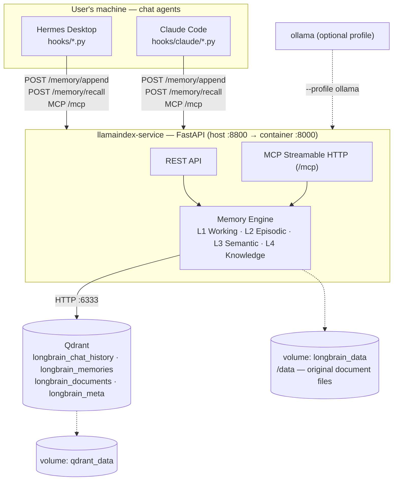

# Longbrain — Shared Long-term Memory for AI Agents (LlamaIndex + Qdrant)

Longbrain is a Docker-packaged long-term memory system for AI agents. It
doesn't depend on any specific agent, so multiple agents can share the
same memory. Each user runs their own independent stack — data is always
stored locally and stays fully private.

By default it needs **no API key, no Ollama, and no Python packages to
install** — the host-side scripts and hooks run on the stock system
`python3`, stdlib only.

Two full adapters ship today: **Hermes Desktop** and **Claude Code**. Both
access the same memory store, so what you teach one agent, the other
recalls. **Codex** is wired at MCP-only tier (memory tools without
automatic recording), and any MCP client can connect manually — see the
[support tiers](adapters/README.md#support-tiers). Adding a new agent only
means writing a new adapter — the system's architecture doesn't change.

## Why it exists

- **Real long-term memory, not a stopgap.** A plain chat forgets everything
  when the window closes; a hand-maintained `CLAUDE.md` needs you to curate
  it forever. Longbrain records, distills, recalls and drops outdated
  information automatically.
- **Shared across agents.** Teach something in one tool, the others already
  know it — no re-explaining every time you switch.
- **Cost per turn stays roughly flat.** Only what's relevant to the current
  question is recalled, and the injection is size-capped — unlike a
  `CLAUDE.md` that loads in full, every turn, and only grows.
- **Doesn't have to cost extra money.** Runs on a subscription you already
  pay for (Claude Code) or a local model (Ollama) — a paid API key is never
  required.
- **Visible and correctable, fully private.** The `/ui` page shows
  everything the system remembers as an interactive graph — fix or delete
  entries instead of guessing what the AI thinks it knows. Everything stays
  on your machine, with nightly backups.

Worth considering: it needs Docker (1–2 background containers), one
`./setup.sh` run, and the distillation quality depends on the model doing
it. It is **personal, single-machine** memory by design — no sync, no
multi-user (see [docs/ARCHITECTURE.md](docs/ARCHITECTURE.md)).

## Architecture at a glance



- **L1 Working memory** — current session's recent turns
- **L2 Episodic memory** — every conversation turn, searchable semantically
- **L3 Semantic memory** — facts/preferences/decisions/tasks distilled by
  consolidation, with automatic dedup/supersede
- **L4 Knowledge base** — document RAG (each project's `docs/` folder is
  auto-ingested)

The whole lifecycle runs **automatically**: record → recall → consolidate →
controlled forgetting → nightly backup. Before every turn, a hook injects
only the relevant, size-capped slice of memory — nothing relevant, nothing
injected.

## Install (3 steps)

1. Install [Docker Desktop](https://docs.docker.com/get-docker/).
2. Install Hermes Desktop and/or Claude Code — whichever agents you use.
3. In this directory run:

```bash
./setup.sh
```

**No manual steps remain.** The script creates `.env`, builds & starts the
containers, wires every installed agent (hooks + MCP), and installs the
nightly backup and the `docs/` ingest watcher. Idempotent — safe to re-run.
Restart open agent sessions to pick the hooks up.

**Verify** after a few chats:

```bash
curl localhost:8800/health   # last_written_at must advance after every turn
```

Then open `http://localhost:8800/ui` to watch your memory graph grow.

## Documentation

| Document | What's in it |
|---|---|
| [docs/USER_GUIDE.md](docs/USER_GUIDE.md) | Daily use: how memory works, the `/ui` browser, fixing/forgetting memories, the `docs/` folder, backup, export/import |
| [docs/API.md](docs/API.md) | REST + MCP reference: every endpoint and tool with sample requests/responses |
| [docs/ARCHITECTURE.md](docs/ARCHITECTURE.md) | How it works inside: data flows, Qdrant schema, multi-agent provenance, source layout |
| [docs/OPERATIONS.md](docs/OPERATIONS.md) | Setup internals, provider config (.env), health checks, backup restore, troubleshooting |
| [docs/ROADMAP.md](docs/ROADMAP.md) | Completed milestones, what's next, deliberate non-goals |
| [adapters/README.md](adapters/README.md) | Writing an adapter for a new agent: the 4-lifecycle-moment contract |
| [CONTRIBUTING.md](CONTRIBUTING.md) | Dev setup, tests, what PRs are welcome |

## Repository layout

```
longbrain/
├── setup.sh                 # one-command install (Docker + automatic agent wiring)
├── docker-compose.yml       # qdrant + llamaindex (+ optional ollama profile)
├── docs/                    # user guide, API reference, architecture, operations, roadmap
├── hooks/                   # agent adapters (Hermes Desktop + hooks/claude/ for Claude Code)
├── scripts/                 # setup, backup, ingest watcher, transfer, evals
├── adapters/                # adapter contract docs + minimal example
└── llamaindex-service/      # the memory service (FastAPI + LlamaIndex + MCP) + tests
```

## License

MIT — see [LICENSE](LICENSE).
