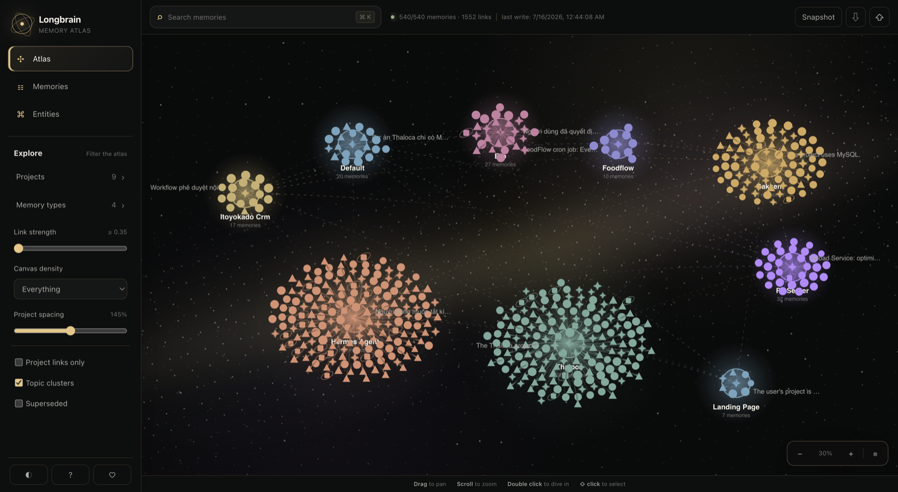
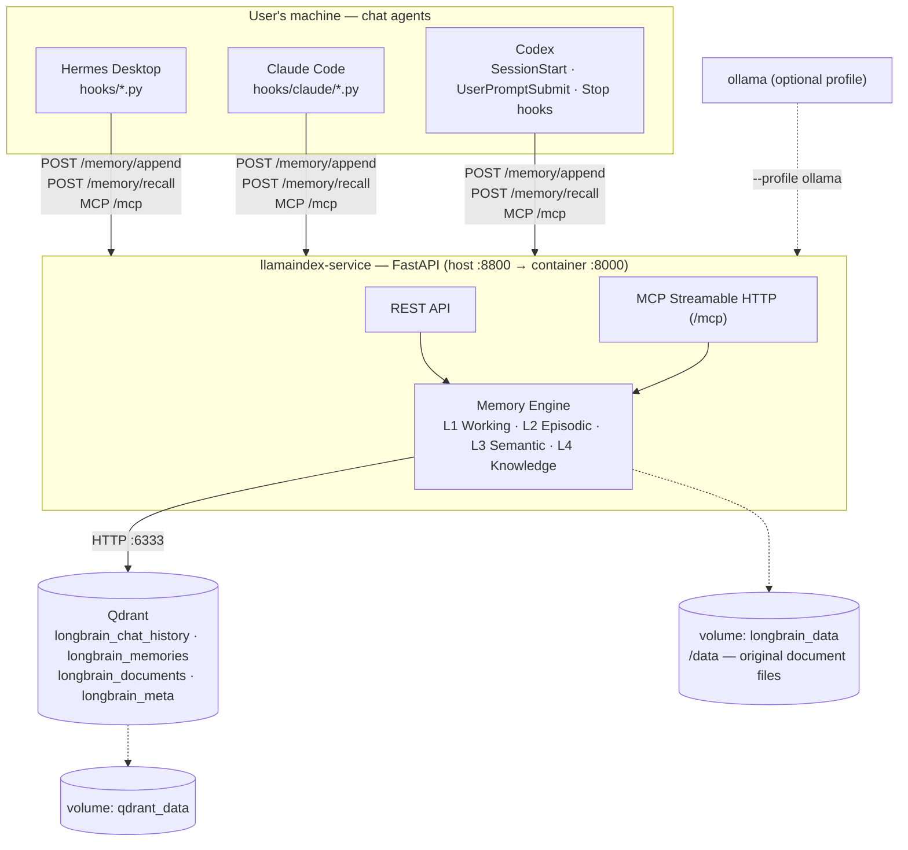

# Longbrain — Local-first Shared Memory for AI Coding Agents

**Shared long-term memory for Claude Code, Codex, Hermes Desktop, and any
MCP-compatible AI agent.** Longbrain is a self-hosted, Docker-packaged memory
system that lets multiple agents share the same project-aware context. Each
user runs an independent stack, so data stays local and fully private.

[Website](https://longbrain.cc.cd) · [User guide](docs/USER_GUIDE.md) · [Latest release](https://github.com/ngocthanh06/longbrain/releases/latest)

By default it needs **no API key, no Ollama, and no Python packages to
install** — the host-side scripts and hooks run on the stock system
`python3`, stdlib only.

Two full adapters ship today: **Hermes Desktop** and **Claude Code**. Both
access the same memory store, so what you teach one agent, the other
recalls. **Codex** ships with official lifecycle hooks for automatic recall,
turn recording, and session-start consolidation catch-up; its older `notify`
adapter remains as a write fallback. Any MCP client can connect manually — see the
[support tiers](adapters/README.md#support-tiers). Adding a new agent only
means writing a new adapter — the system's architecture doesn't change.

## Why it exists

- **Real long-term memory, not a stopgap.** A plain chat forgets everything
  when the window closes; a hand-maintained `CLAUDE.md` needs you to curate
  it forever. Longbrain records, distills, recalls and drops outdated
  information automatically.
- **Shared across agents.** Teach something in one tool, the others already
  know it — no re-explaining every time you switch.
- **Cost per turn stays roughly flat.** Only what's relevant to the current
  question is recalled, and the injection is size-capped — unlike a
  `CLAUDE.md` that loads in full, every turn, and only grows.
- **Doesn't have to cost extra money.** Runs on a subscription you already
  pay for (Claude Code) or a local model (Ollama) — a paid API key is never
  required.
- **Visible and correctable, fully private.** The `/ui` page shows
  everything the system remembers as an interactive graph — fix or delete
  entries instead of guessing what the AI thinks it knows. Everything stays
  on your machine, with nightly backups.

### Memory Atlas



Each project is a movable, color-coded galaxy. Memories form stable rings
around their project hub, while filters, adjustable spacing and wide-range
zoom keep large collections readable.

## Verified by evals, not claims

- **187 tests** (pytest, run in-container) — idempotency, dedup/supersede,
  recall filtering, hook payload parsing, adapter config patching.
- **Recall regression eval**: 12/13 expected hits, **0 violations** (no
  irrelevant memory leaked into the context), 11,460 chars injected across
  the whole eval set. The tracked miss is a genuine two-hop graph query;
  results are gated against a committed baseline (`scripts/recall_eval.py`).
- **Hybrid BM25 measured on a real 450-chunk corpus**: exact-token hit@top-2
  went 1/12 (dense-only) → **11/12**; prompts without identifier-like tokens
  return byte-identical results.

## Known limitations (read before installing)

- **Docker required** — 1–2 background containers running permanently.
- **macOS-first**: launchd jobs (backup, docs watcher) and the agent wiring
  are built and tested on macOS. The service itself is plain Docker, but
  Linux agent wiring is untested.
- **Personal, single-machine by design** — no sync, no multi-user, no
  realtime multi-device (see [docs/ARCHITECTURE.md](docs/ARCHITECTURE.md)).
- **Codex lifecycle gap**: Codex has no `SessionEnd` hook, so consolidation
  catches up on the next `SessionStart` instead of firing when a chat closes.
- **Distillation quality depends on the configured LLM** — a weak local
  model extracts facts less reliably; `LLM_PROVIDER=none` delegates
  distillation to the agent's own model via MCP.
- Status: **stable** — one-command install, eval-guarded recall quality,
  and a full test suite; scope stays personal, single-machine, macOS-first
  (the limitations above).

## Architecture at a glance



- **L1 Working memory** — current session's recent turns
- **L2 Episodic memory** — every conversation turn, searchable semantically
- **L3 Semantic memory** — facts/preferences/decisions/tasks distilled by
  consolidation, with automatic dedup/supersede
- **L4 Knowledge base** — document RAG (each project's `docs/` folder is
  auto-ingested)

The whole lifecycle runs **automatically**: record → recall → consolidate →
controlled forgetting → nightly backup. Before every turn, a hook injects
only the relevant, size-capped slice of memory — nothing relevant, nothing
injected.

## Install

1. Install [Docker Desktop](https://docs.docker.com/get-docker/).
2. Install Hermes Desktop and/or Claude Code — whichever agents you use.
3. Run from the directory where you want Longbrain to live:

```bash
curl -fsSL https://raw.githubusercontent.com/ngocthanh06/longbrain/main/install.sh | bash
```

The bootstrap clones Longbrain into `./longbrain` (override with
`LONGBRAIN_INSTALL_DIR`), or updates that checkout when re-run from the
same directory, then runs `./setup.sh`. To update later, re-run the command
from the same place — or `git pull && ./setup.sh` inside the checkout. To
inspect everything first, clone the repository manually and run `./setup.sh`
from its directory.

**No manual steps remain.** The script creates `.env`, builds & starts the
containers, wires every installed agent (hooks + MCP), and installs the
nightly backup and the `docs/` ingest watcher. Idempotent — safe to re-run.
Restart open agent sessions to pick the hooks up.

**Verify** after a few chats:

```bash
curl localhost:8800/health   # last_written_at must advance after every turn
```

Then open `http://localhost:8800/ui` to watch your memory graph grow.

## Documentation

| Document | What's in it |
|---|---|
| [docs/USER_GUIDE.md](docs/USER_GUIDE.md) | Daily use: how memory works, the `/ui` browser, fixing/forgetting memories, the `docs/` folder, backup, export/import |
| [docs/API.md](docs/API.md) | REST + MCP reference: every endpoint and tool with sample requests/responses |
| [docs/ARCHITECTURE.md](docs/ARCHITECTURE.md) | How it works inside: data flows, Qdrant schema, multi-agent provenance, source layout |
| [docs/OPERATIONS.md](docs/OPERATIONS.md) | Setup internals, provider config (.env), health checks, backup restore, troubleshooting |
| [docs/ROADMAP.md](docs/ROADMAP.md) | Completed milestones, what's next, deliberate non-goals |
| [adapters/README.md](adapters/README.md) | Writing an adapter for a new agent: the 4-lifecycle-moment contract |
| [CONTRIBUTING.md](CONTRIBUTING.md) | Dev setup, tests, what PRs are welcome |

## Repository layout

```
longbrain/
├── setup.sh                 # one-command install (Docker + automatic agent wiring)
├── docker-compose.yml       # qdrant + llamaindex (+ optional ollama profile)
├── docs/                    # user guide, API reference, architecture, operations, roadmap
├── hooks/                   # agent adapters (Hermes Desktop + hooks/claude/ for Claude Code)
├── scripts/                 # setup, backup, ingest watcher, transfer, evals
├── adapters/                # adapter contract docs + minimal example
└── llamaindex-service/      # the memory service (FastAPI + LlamaIndex + MCP) + tests
```

## License

MIT — see [LICENSE](LICENSE).
