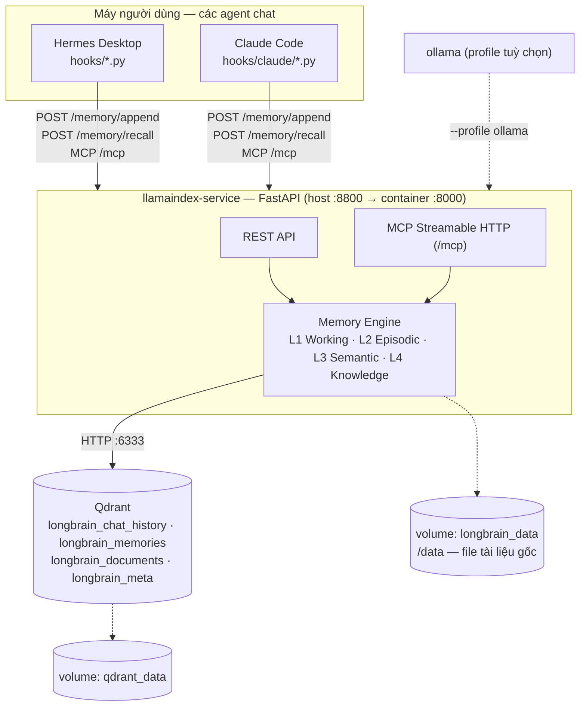

# Longbrain — Bộ nhớ dài hạn dùng chung cho AI Agent (LlamaIndex + Qdrant)

> 🇬🇧 English version: [README.md](README.md)

Longbrain là một hệ thống bộ nhớ dài hạn đóng gói bằng Docker dành cho AI
agent. Hệ thống không phụ thuộc vào bất kỳ agent nào, vì vậy nhiều agent có
thể dùng chung cùng một bộ nhớ. Mỗi người dùng chạy một stack độc lập trên
máy của mình, dữ liệu luôn được lưu cục bộ và hoàn toàn riêng tư.

Mặc định **không cần API key, không cần Ollama, không cần cài Python trên
máy host**.

Hiện dự án hỗ trợ hai adapter: **Hermes Desktop** và **Claude Code**. Cả
hai cùng truy cập một kho bộ nhớ, nên những gì bạn dạy ở agent này sẽ được
agent kia nhớ lại (mỗi bản ghi mang nhãn `source_agent`). Việc bổ sung
agent mới chỉ cần viết thêm adapter, không phải thay đổi kiến trúc của hệ
thống.

## Kiến trúc

> Sơ đồ dùng [Mermaid](https://mermaid.js.org/) — hiển thị được trực tiếp
> trên GitHub và trong VS Code/Cursor (preview markdown có sẵn hoặc qua
> extension "Markdown Preview Mermaid Support"). Nếu trình xem của bạn chỉ
> hiện text thô thay vì hình vẽ thì đó là do trình xem chưa hỗ trợ, không
> phải file lỗi — mở bằng GitHub hoặc preview của VS Code để thấy đúng.



- **L1 Working memory** — `ChatMemoryBuffer` dựng lại theo session
- **L2 Episodic memory** — `longbrain_chat_history` (từng lượt hội thoại, tìm được theo ngữ nghĩa lẫn theo phiên)
- **L3 Semantic memory** — `longbrain_memories` (fact/preference/decision/task do consolidation chưng cất, có dedup/supersede)
- **L4 Knowledge base** — `longbrain_documents` (RAG tài liệu)
- **Embedding**: fastembed (ONNX local, bake sẵn trong image)
- **LLM (cho consolidation)**: `none | anthropic | openai | nvidia | gemini | ollama`

Chi tiết đầy đủ (sơ đồ luồng ghi/chưng cất/truy hồi, schema Qdrant, provenance đa agent...): xem [ARCHITECTURE.md](ARCHITECTURE.md).

Toàn bộ vòng đời của memory diễn ra **tự động**: ghi nhớ → truy hồi →
chưng cất → quên có kiểm soát (tool `forget_about`) → sao lưu. Mặc định
hệ thống sao lưu lúc 02:00 mỗi ngày và giữ lại 7 bản gần nhất.

## Context được xây dựng như thế nào (và vì sao chi phí luôn ổn định)

Trước mỗi lượt chat, một hook gọi `POST /memory/recall`, ghép 3 nguồn thành
một khối ngữ cảnh (context block) rồi tiêm vào prompt (sơ đồ tuần tự đầy đủ:
[ARCHITECTURE.md §3c](ARCHITECTURE.md#3-data-flows)):

- **L3** — fact đã chưng cất liên quan đến câu bạn vừa hỏi (tìm ngữ nghĩa trong `longbrain_memories`)
- **L2** — hội thoại cũ liên quan từ *phiên khác* (tìm ngữ nghĩa trong `longbrain_chat_history`)
- **L1** — các lượt gần nhất của chính phiên hiện tại

Tìm kiếm là **hybrid**: ngữ nghĩa (dense cosine) cộng thêm một kênh từ khóa
BM25 chỉ kích hoạt khi câu hỏi chứa token dạng định danh (`ERR_UPLOAD_413`,
`10MB`, `snake_case`, chuỗi trong ngoặc, …) và chỉ có thể *cứu* những kết
quả khớp chính xác mà model ngữ nghĩa xếp hạng thấp — không bao giờ hạ một
kết quả ngữ nghĩa xuống. Đo trên kho tài liệu thật: tỉ lệ tìm thấy
exact-token trong top-2 tăng từ 1/12 lên 11/12; câu hỏi không chứa token
dạng đó trả kết quả giống hệt như trước. Công tắc tắt: `HYBRID_BM25=false`.

Hai cơ chế giữ cho việc này rẻ, không biến thành một `CLAUDE.md` phình to dần:

1. **Không liên quan → không tiêm gì cả.** Kết quả dưới `RECALL_MIN_SCORE`
   (mặc định `0.25`) bị loại hoàn toàn; nếu cả L2 lẫn L3 đều rỗng, khối
   ngữ cảnh là chuỗi rỗng và hook không in gì ra — **0 token phụ trội** cho
   lượt đó.
2. **Phần được tiêm cũng có giới hạn kích thước cố định**, bất kể bộ nhớ đã
   tích lũy bao nhiêu: `LONGBRAIN_MEMORY_MAX_CONTEXT` (mặc định `6000` ký tự,
   ~1500-2000 token) cắt bớt phần tiêm ở hook Claude Code. Một `CLAUDE.md`
   tự viết tay thì được nạp **toàn bộ, mỗi lượt chat**, và càng ghi thêm
   thì càng to — chi phí mỗi lượt tăng dần theo thời gian. Ở đây chi phí
   mỗi lượt gần như không đổi dù bộ nhớ phình to cỡ nào, vì chỉ phần điểm
   cao nhất, đã giới hạn kích thước, mới được tiêm vào.

Tinh chỉnh qua `.env` nếu muốn đánh đổi độ rộng truy hồi lấy dung lượng nhỏ
hơn (tăng `RECALL_MIN_SCORE`) hoặc thu nhỏ phần tiêm hơn nữa (giảm
`LONGBRAIN_MEMORY_MAX_CONTEXT`).

## Vì sao nên dùng dự án này?

Đây là so sánh khách quan — có cả điểm mạnh lẫn điều cần cân nhắc — để bạn
tự quyết định có phù hợp với cách làm việc của mình hay không.

**Điểm mạnh:**

- **Bộ nhớ thực sự dài hạn, không phải giải pháp tạm thời.** Chat thông
  thường sẽ mất toàn bộ ngữ cảnh khi đóng cửa sổ. Ghi tay vào `CLAUDE.md`
  thì phải tự cập nhật và tự dọn dẹp. Longbrain tự động ghi nhớ, chưng cất,
  truy hồi và loại bỏ thông tin đã lỗi thời mà không cần người dùng can thiệp.
- **Dùng chung được nhiều AI agent, không phải chọn một.** Agent nào có
  adapter (hiện có: Hermes Desktop, Claude Code) đều chạy song song trên
  cùng một bộ nhớ — dạy điều gì đó ở agent này, các agent khác tự biết,
  không phải giải thích lại từ đầu mỗi khi đổi công cụ.
- **Không nhất thiết tốn thêm tiền.** Có thể chạy hoàn toàn bằng chính
  subscription bạn đã trả (Claude Code) hoặc bằng model chạy ngay trên máy
  (Ollama) — không bắt buộc phải có API key trả phí riêng.
- **Chi phí mỗi lượt chat gần như không đổi theo thời gian.** Khác với
  `CLAUDE.md`, nơi toàn bộ nội dung đều được nạp ở mỗi lượt chat, Longbrain
  chỉ truy hồi phần liên quan nhất đến câu hỏi hiện tại và giới hạn kích
  thước context được chèn vào prompt. Dù bộ nhớ tăng lên theo thời gian,
  lượng token bổ sung cho mỗi lượt chat vẫn gần như giữ nguyên.
- **Riêng tư 100%, tự chủ hoàn toàn.** Chạy trên máy bạn, dữ liệu không
  đồng bộ lên đâu cả, tự sao lưu mỗi đêm, tự kiểm soát hoàn toàn.
- **Nhìn thấy được bộ nhớ, không phải "hộp đen".** Trang `/ui` cho xem toàn
  bộ những gì hệ thống đang "nhớ" về bạn dưới dạng đồ thị trực quan — sai
  thì sửa, thừa thì xoá, không phải đoán mò xem AI đang nhớ gì.
- **Tự dọn dẹp, không lộn xộn dần theo thời gian.** Có cơ chế phát hiện
  thông tin trùng lặp/diễn đạt lại và thông tin đã lỗi thời (được thay thế
  bởi thông tin mới hơn) — không phải một đống ghi chú chồng chất vô tổ
  chức sau vài tháng sử dụng.
- **Chuyển máy không sợ mất dữ liệu.** Có sẵn tính năng xuất/nhập toàn bộ
  bộ nhớ dưới dạng file — chuyển máy mới, hoặc đổi cả model embedding, vẫn
  giữ nguyên dữ liệu.

**Điều cần cân nhắc:**

- Cần cài Docker và chạy thêm 1-2 container nền — tốn thêm một chút RAM/CPU
  so với việc không dùng gì cả.
- Cần thực hiện một bước cài đặt ban đầu (`./setup.sh`). Dù phần lớn đã
  được tự động hóa, đây vẫn là một bước bổ sung so với việc chỉ cài AI agent.
- Chất lượng thông tin được "nhớ" phụ thuộc vào model dùng để chưng cất —
  model càng yếu (ví dụ chạy Ollama trên máy yếu) thì khả năng trích xuất
  thông tin đúng/đủ càng giảm so với dùng model mạnh.
- Đây là dữ liệu **cá nhân, một máy** — không đồng bộ giữa nhiều máy hay
  chia sẻ giữa nhiều người dùng (đây là lựa chọn thiết kế có chủ đích, xem
  [ARCHITECTURE.md](ARCHITECTURE.md), không phải giới hạn kỹ thuật tạm thời).

## Cài đặt (3 bước)

1. Cài [Docker Desktop](https://docs.docker.com/get-docker/).
2. Cài Hermes Desktop và/hoặc Claude Code — dùng agent nào cài agent đó.
3. Trong thư mục này chạy:

```bash
./setup.sh
```

**Không còn bước thủ công nào.** Script sẽ tự động: tạo `.env` → build &
khởi động containers → chờ healthcheck → tự wire mọi agent đã cài (agent
nào không có thì bỏ qua):

- **Hermes Desktop**: đăng ký 4 hooks + consent vào `~/.hermes/` → vá bug
  `serve` của Hermes (Desktop không đăng ký hook nếu thiếu) → mượn API key
  sẵn có (NVIDIA/Gemini) cho auto-consolidation → thêm định tuyến memory
  vào `~/.hermes/SOUL.md` (lệnh "nhớ/quên" tường minh đi vào stack này thay
  vì built-in store nhỏ của Hermes) → restart Hermes Desktop.
- **Claude Code**: đăng ký 4 hooks vào `~/.claude/settings.json` + MCP
  server `longbrain` (scope user) qua `scripts/configure_claude.py`.
  **Không cần API key ở bất kỳ đâu**: Claude Code chạy bằng tài khoản đăng
  nhập của bạn, consolidation dùng LLM phía service hoặc MCP tool
  `consolidate_session`. Mở phiên mới để hooks có hiệu lực.

Script cũng cài backup đêm. Chạy lại bao nhiêu lần cũng an toàn (idempotent).

Kiểm tra sau vài lượt chat: `curl localhost:8800/health` — trường
`last_written_at` phải cập nhật sau mỗi lượt.

### Chạy song song Hermes và Claude Code

Không có gì phải "switch": hooks của cả hai agent đăng ký một lần và cùng
ghi vào một service. Slug project luôn nhất quán vì adapter Claude Code tra
cwd vào chính `projects.db` của Hermes trước (ra cùng slug với sidebar),
không khớp mới fallback về tên thư mục gốc git. Mỗi bản ghi mang
`source_agent` (`hermes` / `claude-code`) — xem được trong panel chi tiết
của `/ui`. Lưu ý: stack này bổ trợ cho CLAUDE.md/auto-memory của Claude
Code (hướng dẫn tĩnh theo repo) bằng truy hồi ngữ nghĩa xuyên phiên, xuyên
project; phần context tiêm vào có giới hạn kích thước
(`LONGBRAIN_MEMORY_MAX_CONTEXT`, mặc định 6000 ký tự) vì nó tiêu token
subscription của bạn mỗi lượt.

## Trình duyệt bộ nhớ (`http://localhost:8800/ui`)

Một trang tự chứa để khám phá và quản lý memory đã lưu — không cần thêm
container, không tải asset ngoài, có theme sáng/tối:

- **Graph view — mỗi project là một thiên hà**: mỗi project có hố hấp dẫn
  riêng, kéo memory của nó thành một cụm ("thiên hà") tách biệt trực quan
  (có nhãn tên nổi ở tâm cụm) thay vì dồn thành một khối lộn xộn; liên kết
  ngữ nghĩa xuyên project vẫn hiện như cầu nối mờ giữa các thiên hà mà
  không kéo chúng dính vào nhau. **Hình dạng + màu cùng biểu diễn loại**
  (bảng màu categorical đã kiểm chứng qua dataviz skill): ● fact — hành
  tinh, ☄ preference — sao chổi (đuôi hướng ra xa tâm thiên hà), ✦ decision
  — sao sáng (có quầng sáng), ◌ task — vệ tinh (có vòng quỹ đạo); bấm nút
  `?` để xem chú giải. Kích thước = độ quan trọng, viền đứt = đã bị
  supersede, vòng chấm = các memory khác cùng phiên nguồn với memory đang
  chọn. Rê chuột làm nổi vùng lân cận của node; click mở panel chi tiết
  kèm hiệu ứng gợn sóng. Kéo thả, pan, zoom mượt bằng con lăn, nút `Fit`,
  và click tiêu đề để reset khung nhìn.
- **Tìm kiếm Spotlight (⌘K)**: tìm ngữ nghĩa trực tiếp, có lưu truy vấn
  gần đây — kết quả khớp được làm nổi trên đồ thị và camera lướt tới kết
  quả tốt nhất.
- **Bộ lọc**: chip project và chip loại (click để solo/bật-tắt), công tắc
  hiện superseded, cùng điều khiển cạnh nối — thanh trượt độ tương đồng
  tối thiểu và công tắc "chỉ cùng project".
- **Panel chi tiết**: toàn văn, metadata, các memory liên quan (theo độ
  tương đồng, click để nhảy tới), và transcript của phiên nguồn render
  dạng markdown.
- **Chỉnh sửa** (qua modal chọn project — không phải gõ tay): chuyển một
  memory, gắn lại cả phiên (turns + facts chuyển theo, các lượt chat sau
  đi theo nhờ stickiness), gắn lại hàng loạt bằng đa chọn ⇧click
  ("Select linked" mở rộng ra trọn cụm liên thông), hoặc đổi tên project
  ở mọi nơi (nút ✎ trên chip project).
- **List view** (cùng bộ lọc, dạng bảng) và **xuất PNG** đồ thị.
- **Chuyển máy** (`⇩ Export` / `⇪ Import` trên header): tải toàn bộ bộ nhớ
  về dạng bundle JSON, hoặc nạp bundle từ máy khác — có hộp xác nhận hiển
  thị số lượng bản ghi trong bundle trước khi ghi bất cứ thứ gì
  (xem mục "Chuyển sang máy khác" bên dưới).

- **Sửa lỗi phân loại trong panel chi tiết**: **Change type…** đổi lại loại
  của một memory (fact/preference/decision/task — model trưng cất không
  phải lúc nào cũng phân loại đúng), và **Delete this memory** xoá vĩnh viễn
  memory đó — cả hai đều có hộp xác nhận trước khi thực hiện. Xoá là vĩnh
  viễn, không giữ lại dấu vết như supersede; quên qua Hermes (`forget_about`)
  hoặc REST API cũng hoạt động tương tự.

## Chọn provider (.env)

| Biến | Mặc định | Ý nghĩa |
|---|---|---|
| `EMBED_PROVIDER` | `fastembed` | `fastembed` \| `ollama` \| `openai` \| `nvidia` |
| `EMBED_MODEL` | `paraphrase-multilingual-MiniLM-L12-v2` | Model embedding (đa ngôn ngữ, chạy CPU) |
| `LLM_PROVIDER` | `none`* | `none` \| `anthropic` \| `openai` \| `nvidia` \| `gemini` \| `ollama` |
| `LLM_MODEL` | theo provider | VD `models/gemini-2.5-flash`, `claude-sonnet-5` |
| `*_API_KEY` | — | `ANTHROPIC` / `OPENAI` / `NVIDIA` / `GOOGLE` — setup.sh tự mượn key có sẵn trong `~/.hermes/.env` khi provider đang là `none` |
| `LONGBRAIN_USER_ID` | `local` | Định danh trong payload (để tương lai lên server chung không phải migrate) |

> Mọi biến `LONGBRAIN_*` vẫn nhận tên cũ `HERMES_*` làm alias — bản cài
> hiện có không phải sửa gì.

- **LLM đổi thoải mái** — chỉ dùng cho consolidation và `/chat`.
  Với `none`, chính model của Hermes đảm nhận consolidation qua MCP tool
  `consolidate_session`.
- **Embedding chọn một lần** — đổi model là đổi không gian vector. Service
  ghi model + dimension vào collection meta và **từ chối khởi động** nếu
  config lệch với dữ liệu trên đĩa. Muốn đổi thật: backup → `docker compose
  down -v` → đổi `.env` → chạy lại và re-ingest, hoặc re-embed vào
  collection mới.
- Ollama local (tuỳ chọn): `docker compose --profile ollama up -d`, rồi đặt
  `LLM_PROVIDER=ollama` và `OLLAMA_BASE_URL=http://ollama:11434`.

## MCP tools (đăng ký tại `http://localhost:8800/mcp`)

| Tool | Chức năng |
|---|---|
| `memory_recall(query, session_id?, project?)` | Gộp trí nhớ liên quan (facts + hội thoại cũ + lượt gần nhất) thành một context block |
| `memory_append(session_id, user_message, assistant_response)` | Ghi một lượt hội thoại (idempotent) |
| `consolidate_session(session_id)` | Chưng cất phiên thành facts (server-side nếu có LLM, ngược lại trả transcript + hướng dẫn cho model của Hermes) |
| `save_memories(facts, session_id?, project?)` | Lưu facts đã chưng cất (tự dedup/supersede) |
| `search_history(query, top_k?, project?)` | Tìm ngữ nghĩa trên toàn bộ hội thoại cũ |
| `list_memories(project?)` | Liệt kê facts đã lưu (kèm id) |
| `forget_about(query)` → `forget_memory(id, confirm=true)` | Quên có kiểm soát: liệt kê ứng viên trước, xoá theo id — từ chối nếu thiếu `confirm=true` (chỉ đặt sau khi người dùng đã đồng ý) |
| `forget_session(session_id)` | Xoá trọn lịch sử một phiên |
| `forget_everything(confirm="DELETE ALL")` | Reset toàn bộ memory — bắt buộc đúng chuỗi xác nhận |
| `list_sessions()` / `list_projects()` | Liệt kê phiên / dự án đang có memory |
| `search_knowledge_base(query, top_k?, project?)` | Tìm trong tài liệu đã ingest |
| `add_to_knowledge_base(text, source?, project?)` | Thêm text vào knowledge base |

Các tool nhận `project` (slug dự án trong sidebar Hermes) để khoanh vùng tìm kiếm.

## REST API

```bash
# Trạng thái + kiểm tra memory có đang được ghi không (last_written_at)
curl localhost:8800/health

# Nạp tài liệu
curl -X POST localhost:8800/ingest/text -H 'Content-Type: application/json' \
  -d '{"text": "Nội dung...", "metadata": {"source": "faq.md"}}'
curl -X POST localhost:8800/ingest/file -F "file=@tai-lieu.pdf"

# Truy vấn knowledge base
curl -X POST localhost:8800/query -H 'Content-Type: application/json' \
  -d '{"query": "..."}'

# Memory
curl -X POST localhost:8800/memory/append -H 'Content-Type: application/json' \
  -d '{"session_id": "s1", "user_message": "...", "assistant_response": "..."}'
curl -X POST localhost:8800/memory/recall -H 'Content-Type: application/json' \
  -d '{"query": "dự án hermes dùng vector db gì?", "session_id": "s1"}'
curl -X POST localhost:8800/memory/consolidate -H 'Content-Type: application/json' \
  -d '{"session_id": "s1"}'          # cần LLM_PROVIDER != none
curl -X POST localhost:8800/memory/search -H 'Content-Type: application/json' \
  -d '{"query": "..."}'
curl "localhost:8800/memory/facts?project=erp"      # liệt kê facts
curl -X PATCH localhost:8800/memory/facts/<id>/type -H 'Content-Type: application/json' \
  -d '{"type": "decision"}'                         # đổi loại (fact/preference/decision/task)
curl -X DELETE localhost:8800/memory/facts/<id>     # quên một fact
curl -X DELETE "localhost:8800/memory/all?confirm=DELETE%20ALL"  # reset toàn bộ

# Đồ thị memory (nodes + cạnh tương đồng, cấp dữ liệu cho trang /ui)
curl "localhost:8800/memory/graph?include_superseded=false&min_similarity=0.35"

# Chuyển máy (export/import — xem mục riêng bên dưới)
curl -o bundle.json localhost:8800/memory/export
curl -X POST localhost:8800/memory/import -H 'Content-Type: application/json' \
  --data-binary @bundle.json

# Gắn lại project (chỉnh sửa; slug chỉ gồm chữ thường [a-z0-9_-])
curl -X PATCH localhost:8800/memory/facts/<id> -H 'Content-Type: application/json' \
  -d '{"project_id": "erp"}'                       # chuyển một fact
curl -X PATCH localhost:8800/memory/facts -H 'Content-Type: application/json' \
  -d '{"ids": ["<id1>", "<id2>"], "project_id": "erp"}'   # chuyển hàng loạt
curl -X PATCH localhost:8800/sessions/<id>/project -H 'Content-Type: application/json' \
  -d '{"project_id": "erp"}'    # cả phiên: turns + facts; lượt chat sau đi theo
curl -X PATCH localhost:8800/memory/projects/<slug> -H 'Content-Type: application/json' \
  -d '{"project_id": "ten-moi"}'                   # đổi tên ở mọi nơi

# Sessions & projects
curl localhost:8800/sessions
curl localhost:8800/sessions/s1/history
curl -X DELETE localhost:8800/sessions/s1
curl localhost:8800/projects
```

## Bộ nhớ theo dự án

Memory tự phân vùng **theo dự án**, bất kể agent nào đang chat: hook đọc
thư mục phiên chat (`cwd`) rồi phân giải ra 1 slug project, gắn `project_id`
vào mọi bản ghi. Có 2 nguồn folder→slug được gộp lại, nên hoạt động dù máy
có cài Hermes Desktop hay không: `~/.hermes/projects.db` của Hermes (project
trong sidebar, nếu có) và `~/.hermes/discovered_projects.json` (catalog dự
phòng do adapter Claude Code tự ghi — xem mục "Tự động ingest tài liệu" bên
dưới). Nếu cả 2 đều không khớp và Hermes đang chạy, hook dùng project đang
được **chọn trong sidebar** — nhờ vậy project chỉ-để-chat (không gắn thư
mục) vẫn hoạt động bình thường. Truy hồi ưu tiên ký ức cùng dự án (boost
×1.5) nhưng vẫn thấy được ký ức dự án khác khi thực sự liên quan; tài liệu
thì lọc cứng theo dự án. Tạo project mới là tự nhận — không cần cấu hình.
Xem chi tiết: [ARCHITECTURE.md](ARCHITECTURE.md).

## Backup

Tự động chạy **2:00 sáng hàng ngày** (launchd; nhờ `RunAtLoad` còn chạy
thêm một lần mỗi khi boot/đăng nhập, phòng khi máy tắt lúc 2:00; giữ 7 bản
mới nhất; log tại `logs/backup.log`) — setup.sh đã cài. Chạy tay khi cần:

```bash
./scripts/backup.sh    # snapshot mọi collection longbrain_* vào ./backups/
```

## Tự động ingest tài liệu (docs/ watcher)

Cứ phải `curl` tay từng file vào knowledge base thì rất bất tiện. Thay vào đó,
bỏ file vào **thư mục con `docs/` bên trong thư mục của project** —
`scripts/ingest_watcher.py` sẽ tự động lấy:

- Được `setup.sh`/`configure_hermes.py` cài như một launchd agent, quét 1 lần
  mỗi 60 giây (`com.longbrain.memory-ingest.plist.template`; không phải daemon
  chạy liên tục, không cần thư viện `watchdog`/inotify — "quét" nghĩa là so
  sánh (mtime, size) với lần chạy trước).
- **Hoạt động dù có hay không có Hermes Desktop.** Danh sách thư mục project
  lấy từ 2 nguồn gộp lại: `~/.hermes/projects.db` của Hermes (nếu có cài), và
  `~/.hermes/discovered_projects.json` — 1 catalog dự phòng mà adapter Claude
  Code tự ghi vào ngay lần đầu bạn chat trong 1 thư mục project
  (`hooks/project_catalog.py`). Máy chỉ dùng Claude Code, hoàn toàn không cài
  Hermes Desktop, vẫn tự phát hiện được mọi project theo cách này — không cần
  cấu hình gì thêm.
- **Opt-in theo từng project**: chỉ theo dõi khi `<thư mục project>/docs/`
  tồn tại — tránh lỡ tay ingest nguyên một repo code.
- Hỗ trợ: `.pdf .md .txt .docx`. File mới/đổi được gửi lên `/ingest/file` kèm
  đúng `project_id`; file không đổi được bỏ qua ở cả 2 lớp — local (state file
  tại `~/.hermes/ingest_watcher_state.json`) và server-side
  (`documents.already_ingested` — lớp phòng hộ nếu state file bị mất, đảm bảo
  chạy lại watcher không bao giờ tạo ra chunk trùng lặp).
- Log: `logs/ingest_watcher.log`. Chạy tay 1 lần: `python3 scripts/ingest_watcher.py`.

## Chuyển sang máy khác (export / import)

Snapshot hàng đêm là **dữ liệu nhị phân, gắn chặt với embedding model** —
chỉ khôi phục được đúng máy cũ, không mang bộ nhớ sang một bản cài mới
(có thể chạy model khác) được. Việc đó dùng bundle chuyển máy ở mức văn bản:

```bash
# máy cũ
./scripts/memory_transfer.sh export            # -> backups/memory-export-<stamp>.json

# máy mới (sau khi chạy setup.sh, service đang chạy)
./scripts/memory_transfer.sh import memory-export-<stamp>.json
```

Bundle chỉ chứa phần văn bản (facts, lượt chat, chunk tài liệu) — không chứa
vector. Import sẽ **re-embed toàn bộ bằng model hiện tại**, giữ nguyên
timestamps / liên kết supersede / cờ consolidated (nhờ đó suy giảm theo thời
gian và nguồn gốc fact vẫn hoạt động, phiên đã import không bị chưng cất
lại), và bỏ qua bản ghi đã tồn tại — chạy lại lần nữa vẫn an toàn.

## Cấu trúc repository

```
longbrain/
├── setup.sh                 # cài đặt một lệnh (Docker + cấu hình Hermes tự động)
├── docker-compose.yml       # qdrant + llamaindex (+ ollama optional profile)
├── .env.example
├── ARCHITECTURE.md          # tài liệu kiến trúc chi tiết
├── UPGRADE_PLAN.md          # lộ trình nâng cấp + tiến độ
├── hooks/
│   ├── post_llm_call.py     # Hermes: ghi từng lượt chat (kèm project từ sidebar)
│   ├── pre_llm_call.py      # Hermes: tự tiêm memory vào mỗi lượt chat
│   ├── on_session_end.py    # Hermes: trigger chưng cất khi phiên kết thúc
│   ├── on_session_start.py  # Hermes: quét bù khi mở Desktop
│   ├── project_catalog.py   # fallback project→folder không phụ thuộc agent (không cần Hermes)
│   └── claude/              # adapter Claude Code (cùng vòng đời, 4 hooks)
├── scripts/
│   ├── configure_hermes.py  # tự cấu hình Hermes (hooks + consent + vá serve + key + backup + ingest)
│   ├── configure_claude.py  # tự cấu hình Claude Code (hooks settings.json + MCP)
│   ├── backup.sh            # snapshot Qdrant (launchd gọi hàng đêm)
│   ├── ingest_watcher.py    # tự ingest thư mục docs/ của mỗi project (launchd gọi mỗi 60s)
│   └── memory_transfer.sh   # export/import mức văn bản để chuyển máy
└── llamaindex-service/      # memory service (FastAPI + LlamaIndex + MCP)
    └── tests/               # bộ test pytest (chạy trong container, xem bên dưới)
```

## Kiểm thử

```bash
docker compose run --rm --no-deps --entrypoint sh \
  -v "$PWD:/repo" llamaindex \
  -c "pip install -q 'pytest>=8,<9' && cd /repo/llamaindex-service && python -m pytest tests -q"
```

Bao phủ: tính idempotent của point-id, dedup/supersede facts, bộ lọc
min-score của recall (chạy với Qdrant in-process), parse output LLM (phân
biệt lỗi parse với `[]` chủ đích), cắt ngắn transcript, và phần trích
payload của hooks + phân giải cwd→project (longest prefix, project đã
archive, symlink).

## Lưu ý vận hành

- **Sau mỗi lần cập nhật Hermes Desktop, hãy chạy lại `./setup.sh`** — bản
  update ghi đè patch `serve` (Desktop backend không đăng ký hook nếu thiếu
  patch này).
- **Sửa file nào trong `hooks/` xong cũng chạy lại `./setup.sh`** — consent
  hook gắn với mtime của script.
- **Muốn xoá memory: nói với Hermes ("quên chuyện X đi") hoặc dùng API**,
  đừng xoá trong Qdrant dashboard — dashboard có toàn quyền ghi/xoá không
  xác nhận, dễ tạo cảm giác "hệ thống tự mất dữ liệu".
