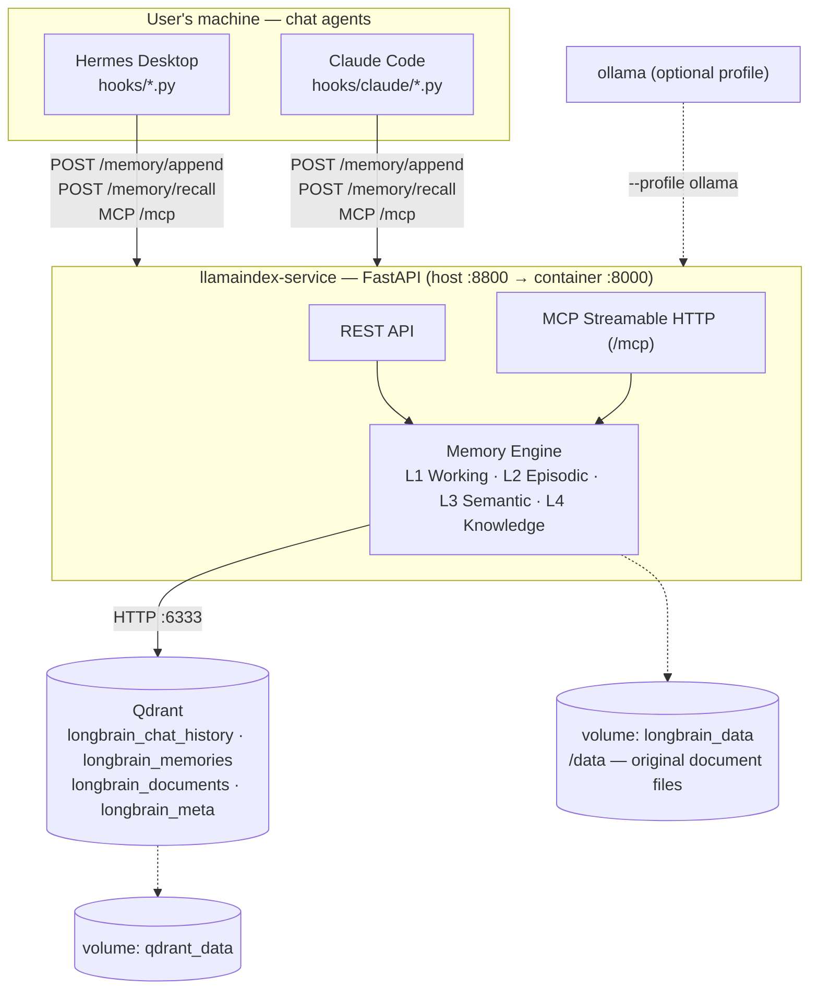
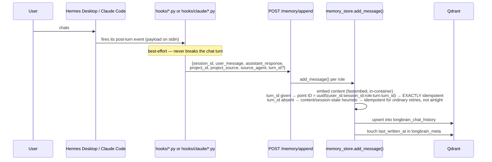
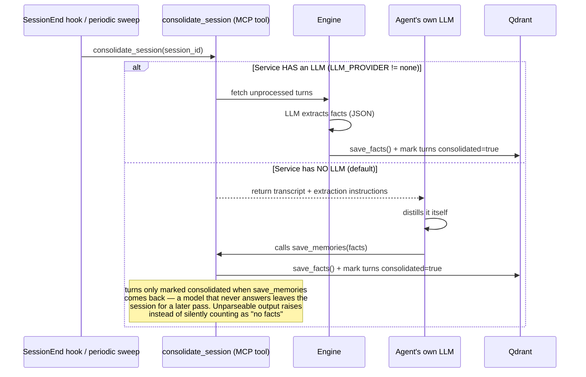
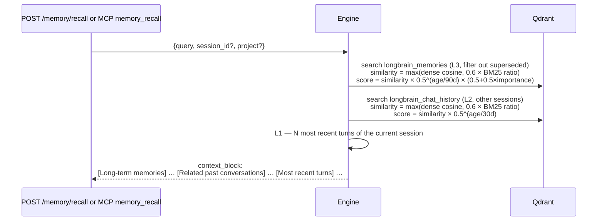
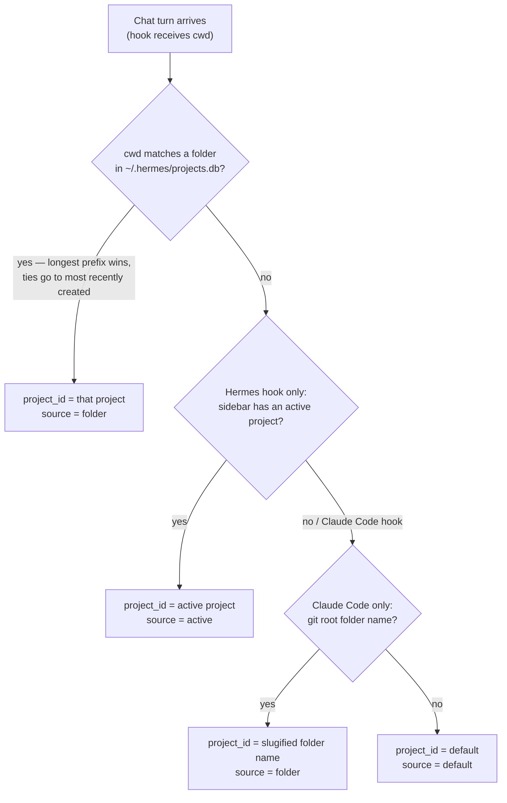

# Longbrain Architecture

Detailed technical documentation. For quick install/usage instructions see [README.md](../README.md).

> Diagrams in this document use [Mermaid](https://mermaid.js.org/) fenced
> code blocks — they render natively on GitHub/GitLab and in VS Code /
> Cursor (built-in preview or the Markdown Preview Mermaid Support
> extension). If your viewer shows raw text instead of a diagram, that's a
> viewer limitation, not a broken file — open it on GitHub or in VS Code's
> markdown preview to see it rendered.

## 1. Overview

A Docker-packaged **long-term memory shared by multiple chat agents**,
following a **single-user, local-first** model: each user runs an
independent stack, all data lives entirely on their machine — no sync, no
sharing. Today two agents ship: **Hermes Desktop** and **Claude Code**. They
run in parallel against the *same* memory — teach one, the other recalls —
each record tagged with which agent produced it (`source_agent`).



## 2. The four memory layers

| Layer | Role | Stored in | Module |
|---|---|---|---|
| **L1 Working** | Current-session context — a `ChatMemoryBuffer` (~3000-token cap) rebuilt from L2 every turn | RAM (rebuilt per request) | `main.py` |
| **L2 Episodic** | Every raw conversation turn (user + assistant), embedded → semantically searchable across sessions | `longbrain_chat_history` | `memory_store.py` |
| **L3 Semantic** | Facts distilled from L2: decisions, preferences, project info, tasks — the permanently memorable stuff | `longbrain_memories` | `memories.py`, `consolidation.py` |
| **L4 Knowledge** | Ingested documents (PDF/text/markdown) — classic RAG | `longbrain_documents` + original files in `/data/documents` | `documents.py` |

All four layers are agent-agnostic — the engine has no idea whether a turn
came from Hermes or Claude Code. Provenance rides along as one extra payload
field (`source_agent`), not a structural split.

## 3. Data flows

### 3a. Write flow (every chat turn, automatic)



The hook set differs per agent (see §7) but the contract is identical: POST
the turn, best-effort. Claude Code and Codex pass a real `turn_id` (a
transcript entry uuid / the agent's own turn id) so retries are exactly
idempotent; Hermes forwards one when its payload carries it (observed in
most real payloads) and otherwise, like any caller with no stable turn id,
falls back to a content/session-state heuristic that is best-effort only
(see §6, `POST /memory/append`).

### 3b. Distillation flow (consolidation, L2 → L3)



```
save_facts() deduplicates on two levels:
  1. Exact hash (point ID from sha256 of normalized text) → skip if duplicate
  2. Similarity ≥ 0.92 with a currently active fact → the old fact is marked
     superseded_by=<new id> (kept for traceability, excluded from recall)
```

### 3c. Read flow (recall)



**Hybrid exact-token channel** (`app/hybrid.py`): every collection carries a
named sparse vector `bm25` (fastembed `Qdrant/bm25`; Qdrant applies IDF via
`Modifier.IDF`) next to the unnamed dense vector. The query side only
searches identifier-like terms (tokens with digits, snake_case, CamelCase,
acronyms, dotted.paths, quoted spans) — feeding the full natural-language
question in lets common Vietnamese words outscore the one rare token
(measured: 0/12 rescued), since fastembed has no vi/ja stopwords. Fusion is
client-side `max(dense_cosine, RECALL_BM25_WEIGHT × bm25_ratio)` rather
than server RRF, whose rank-based scores would break every
cosine-calibrated mechanism above (min-score, decay, importance, boost). A
prompt with no identifier-like token skips the channel entirely, so
ordinary recalls are byte-identical to dense-only. Data predating the
sparse schema needs `scripts/migrate_hybrid_bm25.py` (Qdrant cannot add a
sparse vector to an existing collection); until then everything degrades
to dense-only. Kill switch: `HYBRID_BM25=false`.

## 4. Qdrant schema

All vector collections use Cosine distance. The MEMORY collections
(chat history + memories) follow the global embedding model (default 384 —
`paraphrase-multilingual-MiniLM-L12-v2`); the DOCUMENTS collection may live
in its own vector space via `DOC_EMBED_*` (default `BAAI/bge-m3`, 1024d —
see [SEARCH_SPEC](SEARCH_SPEC.md): cross-lingual doc search cleared the
1.3× bar, while the memory thresholds calibrated on MiniLM stay untouched).
Each data collection additionally carries a named sparse vector `bm25`
(IDF modifier) for the hybrid exact-token channel (§3c); the dense vector
stays unnamed.

### `longbrain_chat_history` (L2)
```jsonc
// point ID: uuid5("msg:{user_id}:{session_id}:{role}:{sha256(content)}")
{
  "user_id": "local",        // payload index — ready for future multi-user
  "session_id": "…",         // payload index
  "project_id": "erp",       // payload index — see §10 (project partitioning)
  "role": "user|assistant",  // payload index
  "content": "…",
  "timestamp": 1783229012.9, // payload index (float)
  "consolidated": false,     // payload index — distilled yet or not
  "source_agent": "hermes"   // optional — "hermes" | "claude-code" | "codex"; absent on
                              // records written before provenance was added
}
```

### `longbrain_memories` (L3)
```jsonc
// point ID: uuid5("fact:{user_id}:{sha256(normalized_text)}")
{
  "user_id": "local",
  "session_id": "…",              // source session
  "project_id": "erp",            // payload index — inherited from the source session
  "type": "fact|preference|decision|task",
  "text": "…",
  "importance": 0.8,              // 0..1
  "created_at": 1783229012.9,
  "superseded_by": "<point-id>",  // only present when replaced by a newer fact
  "source_agent": "claude-code"   // optional — inherited from the session's first turn
}
```

### `longbrain_documents` (L4)
Managed by LlamaIndex's `QdrantVectorStore` (chunks + metadata `user_id`,
`source`, `stored_path` → original file in `/data/documents/<sha12>_<name>`).
`stored_path` is content-addressed (the sha lives in the filename) and
payload-indexed, so `documents.already_ingested` can cheaply check "has this
exact file already been indexed" — `/ingest/file` uses it to make re-sending
an unchanged file a no-op instead of piling up duplicate chunks. This is what
lets `scripts/ingest_watcher.py` poll each project's `docs/` folder (§9, §10)
and re-run safely.

### `longbrain_meta` (guard)
A single fixed point, vector dim=1: `{schema_version, embed_provider,
embed_model, embed_dim, doc_embed_provider, doc_embed_model, doc_embed_dim,
last_written_at}`. At startup the service compares the current config against
the meta — **an embedding mismatch refuses to boot** (protects both vector
spaces; the `doc_*` fields are null-safe for data written before they
existed). A doc embedder that is configured but cannot LOAD is different
from a mismatch: the service still boots, memory search works, and document
endpoints return a typed 503 `doc_embedder_unavailable` (`/health` exposes
`doc_embedder_ready`).

## 5. Providers (configured via .env)

| | Embedding (memory) | Doc embedding | LLM |
|---|---|---|---|
| Role | Vector space of facts/history — **pick once** | Vector space of documents only — **pick once** | Only used for consolidation + `/chat` — **swap freely** |
| Default | `fastembed` (local ONNX, baked into the image, no key, no GPU) | `huggingface` + `BAAI/bge-m3` (local, downloads ~2.3GB to the `/data` volume on first use) | `none` (the agent's own model distills via MCP) |
| Options | `ollama`, `openai`, `nvidia` | those + `huggingface` (empty `DOC_EMBED_MODEL` = share the memory embedder) | `anthropic`, `openai`, `nvidia`, `gemini`, `ollama` |
| How to change | Backup → `docker compose down -v` → edit .env → re-ingest (the meta guard blocks silent changes) | `scripts/migrate_doc_embed.py` (backs up, recreates + re-embeds ONLY the documents collection) | Edit `.env` + API key → `docker compose up -d` |

A fourth, optional knob `DOC_LLM_*` (default Ollama + qwen3) powers the
document Optional tier — ai-summary enrichment chunks and `/query/explain` —
and is deliberately separate from `LLM_PROVIDER` so document features can
never silently change distillation behavior. No Ollama = those features are
simply absent; Core search is unaffected.

`fastembed` and `sentence-transformers` are **hard-pinned** in
requirements.txt — fastembed has changed its pooling behavior between minor
versions before, and any drift in either library would silently shift a
vector space between two image builds.

## 6. API surface

### REST (`http://localhost:8800`)
| Endpoint | Purpose |
|---|---|
| `GET /health` | Status + `last_written_at` + point counts per collection |
| `POST /memory/append` | Record one conversation turn (called by a hook) — idempotent when `turn_id` is given, best-effort otherwise (see §3a) |
| `POST /memory/recall` | Combined recall of L1+L2+L3 → context_block |
| `POST /memory/facts` | Save distilled facts |
| `POST /memory/search` | Search L3 |
| `POST /memory/consolidate` | Distill (requires LLM; `background: true` for hooks) |
| `GET /memory/pending-consolidation` | Sessions awaiting distillation |
| `POST /memory/consolidate-pending` | Debounced catch-up sweep over all pending sessions |
| `GET /memory/facts` · `DELETE /memory/facts/{id}` | List / forget facts |
| `GET /memory/graph` | Facts as nodes + similarity edges (feeds `/ui`) |
| `GET /ui` | Memory browser — galaxy graph + list view, filters, semantic search, re-tagging |
| `PATCH /memory/facts/{id}` | Move one fact to another project |
| `PATCH /memory/facts` | Bulk move: `{ids: [...], project_id}` (multi-select in `/ui`) |
| `PATCH /memory/facts/{id}/type` | Reclassify a fact's type (fact/preference/decision/task) — `/ui` correction for the consolidation model |
| `PATCH /sessions/{id}/project` | Re-tag a whole session (turns + its facts; future turns follow) |
| `PATCH /memory/projects/{slug}` | Rename a project across chat history, facts and documents |
| `DELETE /sessions/{id}` | Delete an entire session |
| `DELETE /memory/all` | Full wipe — requires `?confirm=DELETE%20ALL` |
| `GET /memory/export` | Download every fact/turn/document chunk as one JSON bundle (see §12) |
| `POST /memory/import` | Re-embed and upsert a bundle produced by `/memory/export` |
| `POST /ingest/text` · `/ingest/file` | Ingest documents into L4 |
| `POST /query` | Search L4 |
| `POST /chat` | Chat directly with the service (requires LLM; 503 if `none`) |
| `GET /projects` | List known project slugs |
| `GET /sessions` · `/sessions/{id}/history` | List sessions / session contents |

### MCP tools (`http://localhost:8800/mcp`, Streamable HTTP)
`memory_recall` · `memory_append` · `consolidate_session` · `save_memories` ·
`list_memories` · `forget_about` · `forget_memory` · `forget_session` ·
`forget_everything` · `search_history` · `list_sessions` · `list_projects` ·
`search_knowledge_base` · `add_to_knowledge_base` — all search/write tools
accept an optional `project` param.

## 7. Agent integration — adapters on a shared core

The memory engine has no agent-specific code. Each agent gets a thin adapter:
a handful of lifecycle hooks that call the same REST/MCP surface above. This
is a deliberate architectural choice (see §8) — adding a third agent means
writing another adapter, not touching the engine.

### 7a. Hermes Desktop

`setup.sh` → `scripts/configure_hermes.py` automates everything (idempotent):

1. **`~/.hermes/config.yaml`**: 4 hooks + `hooks_auto_accept: true` + MCP server:
   - `post_llm_call` → record every chat turn into memory (with the project from cwd)
   - `pre_llm_call` → auto-inject memory: recall based on user_message, return
     `{"context": ...}` (Hermes' official contract) — the model no longer has
     to remember to call a tool
   - `on_session_end` → trigger background consolidation for the session that just ended
   - `on_session_start` → debounced catch-up sweep when Desktop opens
   Additionally: borrows an API key from `~/.hermes/.env` (NVIDIA → Gemini) for
   auto-consolidation, installs the 2:00 AM launchd backup (7-copy retention), and
   adds a **memory-routing block to `~/.hermes/SOUL.md`** — Hermes has a built-in
   memory tool (a ~2200-char text file) that competes with the MCP tools when the
   user gives explicit "remember/forget" commands; this block routes long-term
   facts to MCP (Qdrant), while the built-in keeps only core identity.
2. **`~/.hermes/shell-hooks-allowlist.json`**: hook consent (Hermes requires
   per-command approval; Desktop has no TTY to ask → must be pre-recorded).
   ⚠️ Consent is tied to the script's mtime — **editing a hook file means re-running setup.sh**.
3. **Hermes bug patch** (`hermes_cli/main.py`): the `serve` command (the Desktop
   backend) is missing from `_AGENT_COMMANDS`, so shell hooks are never registered
   for Desktop chats (CLI works, Desktop silently doesn't). The patch adds `"serve"`.
   ⚠️ **A Hermes update overwrites the patch — re-run `./setup.sh` after every update.**

### 7b. Claude Code

`setup.sh` → `scripts/configure_claude.py` (idempotent, skipped if the `claude`
CLI isn't found):

1. **`~/.claude/settings.json`**: 4 hooks mirroring the same lifecycle —
   `UserPromptSubmit` (auto-inject recall), `Stop` (record the turn —
   prefers the payload's `last_assistant_message`, since the transcript file
   hasn't always flushed the closing reply when the hook fires),
   `SessionEnd` (consolidate), `SessionStart` (catch-up sweep, no output —
   `UserPromptSubmit` already owns context injection).
2. **MCP registration**: `claude mcp add --scope user --transport http
   longbrain http://localhost:8800/mcp` — available in every project.
3. **Optional `~/.claude/CLAUDE.md` block** (consent-gated, interactive only):
   tells Claude to prefer the `mcp__longbrain__*` tools over its own
   built-in file-based auto-memory when both are available.

**No API key anywhere on this path** — Claude Code runs on its own
subscription login; consolidation uses the service-side LLM or the
`consolidate_session` MCP tool (the agent's own model distills).

### 7c. Codex

`setup.sh` -> `scripts/configure_codex.py` (idempotent, skipped if Codex is
not installed):

1. **MCP registration**: `[mcp_servers.longbrain]` in
   `~/.codex/config.toml`, pointing at `http://localhost:8800/mcp`.
2. **Official lifecycle hooks** in `~/.codex/hooks.json`:
   `SessionStart` calls `/memory/consolidate-pending`; `UserPromptSubmit`
   calls `/memory/recall` and returns bounded `additionalContext`; `Stop`
   pairs the saved prompt with `last_assistant_message` and calls
   `/memory/append` with `source_agent="codex"`.
3. **Legacy write fallback**: wraps Codex's top-level `notify` command with
   `hooks/codex/turn_ended.py`. The hook scans recent rollout JSONL files
   under `~/.codex/sessions`, extracts real user prompts plus final assistant
   answers, and posts each completed turn to `/memory/append` with
   `source_agent="codex"`. Any previous notify command is chained, so existing
   Codex desktop notifications keep working.

Codex now has automatic recall and recording. It still has no `SessionEnd`
event, so consolidation uses the debounced `SessionStart` catch-up sweep
rather than running exactly when a chat closes. Non-managed hooks must be
reviewed and trusted once through Codex's `/hooks` UI.

## 8. Multi-agent operation & provenance

**Why adapters instead of "the Hermes stack":** Hermes Desktop only
accepts an API key, not a Claude subscription login — a real barrier for
users who pay for Claude Pro/Max but have no API key. Claude Code (and
similarly Codex-style CLIs) log in with the subscription directly. The
memory engine was already agent-agnostic by construction, so the fix was
additive: a second adapter, not a rewrite. The repo's framing shifted from
"memory stack for Hermes" to "long brain + N adapters."

**Running Hermes and Claude Code in parallel** works with no explicit
"switch" — each adapter's hooks/notify command are registered independently
and write to the same service:
- **Project-slug coherence.** The Claude Code resolver tries Hermes'
  `projects.db` first (matching the session's `cwd` against folder-anchored
  projects) so a shared workspace gets the *same* slug from both agents;
  only if that misses does it fall back to the git-root folder name, then
  `"default"`. This means a project touched from both agents stays one
  cluster, not two.
- **Provenance, not partitioning.** Every write carries `source_agent`
  (`"hermes"` | `"claude-code"` | `"codex"`), visible in `/ui`'s detail panel and
  preserved through consolidation (a distilled fact inherits its source
  session's `source_agent`) and through export/import bundles. It's pure
  metadata — recall, dedup/supersede and project partitioning all ignore it,
  so "which agent said it" never affects what a query returns.
- **Session stickiness still applies per session** (see §10) — a session
  started by one agent doesn't get silently re-tagged by the other.

## 9. Operations

- **Liveness check**: `curl localhost:8800/health` — `last_written_at` must
  advance after every chat turn. Visual view: `http://localhost:6333/dashboard`.
- **Hook diagnostics**: `hermes hooks doctor` (Hermes) · raw payloads of
  every hook invocation live in `logs/hook-debug.jsonl` (Hermes) and
  `logs/claude-hook-debug.jsonl` (Claude Code).
- **Backup**: `./scripts/backup.sh` — snapshots every collection into
  `./backups/` (binary, same-machine restore only — see §12 for moving to
  another machine or embedding model).
- **Docs auto-ingest**: `./scripts/ingest_watcher.py` — one poll pass per
  invocation (launchd runs it every 60s), reads project folders from
  `~/.hermes/projects.db` merged with the Hermes-independent fallback
  catalog (§11), sends new/changed files under each project's `docs/`
  subfolder to `/ingest/file`. Log: `logs/ingest_watcher.log`.
- **Data**: named volumes `qdrant_data` (vectors) + `longbrain_data` (original files).
  `docker compose down -v` = wipe everything and start over.
- **Ports**: 8800 (service — keeps 8000 free for Hermes' hindsight server),
  6333/6334 (Qdrant), 11434 (Ollama if the profile is enabled).

## 10. Source layout

```
longbrain/
├── setup.sh                     # one-command install: Docker + auto-wiring for every installed agent
├── docker-compose.yml           # qdrant + llamaindex (+ optional ollama profile)
├── .env.example                 # provider/collection configuration
├── docs/                        # this document, user guide, API reference, operations, roadmap
├── hooks/
│   ├── post_llm_call.py         # Hermes: record each turn (project resolution: folder → active sidebar → default)
│   ├── pre_llm_call.py          # Hermes: auto-inject recalled memory into every turn
│   ├── on_session_end.py        # Hermes: trigger consolidation when a session finishes
│   ├── on_session_start.py      # Hermes: debounced catch-up sweep when Desktop opens
│   ├── project_catalog.py       # agent-agnostic project→folder fallback (§11) — no Hermes required
│   └── claude/                  # Claude Code adapter — same lifecycle, 4 hooks
│       ├── common.py            #   shared HTTP/project-resolution helpers
│       ├── user_prompt_submit.py
│       ├── stop.py
│       ├── session_end.py
│       └── session_start.py
├── scripts/
│   ├── configure_hermes.py      # auto-patch config.yaml + consent + serve bug + app restart
│   ├── configure_claude.py      # auto-wire Claude Code (settings.json hooks + MCP registration)
│   ├── configure_codex.py       # auto-wire Codex (lifecycle hooks + MCP + notify fallback)
│   ├── doctor.py                # read-only wiring + health check across all agents (--fix)
│   ├── backup.sh                # Qdrant snapshots (nightly via launchd)
│   ├── ingest_watcher.py        # auto-ingest each project's docs/ folder (60s poll via launchd)
│   ├── memory_transfer.sh       # text-level export/import for device migration (§12)
│   └── migrate_hybrid_bm25.py   # one-time: recreate collections with the bm25 sparse vector (§3c)
├── logs/
│   ├── hook-debug.jsonl         # raw payload of every Hermes hook run (diagnostics)
│   └── claude-hook-debug.jsonl  # same, for the Claude Code adapter
└── llamaindex-service/
    ├── Dockerfile               # fastembed model baked in
    ├── requirements.txt         # fastembed hard-pinned ==0.7.4
    ├── requirements-dev.txt     # pytest (see "Testing" in README)
    ├── tests/                   # pytest suite (runs in the container)
    └── app/
        ├── main.py              # FastAPI endpoints + lifespan + MCP mount + /ui route
        ├── config.py            # env parsing, constants
        ├── providers.py         # embedding + LLM factory per provider
        ├── qdrant_setup.py      # auto-init collections/indexes + schema guard
        ├── memory_store.py      # L2: write/read/search conversations (deterministic IDs, stickiness)
        ├── memories.py          # L3: save_facts (dedup/supersede) + recall + decay + graph data
        ├── hybrid.py            # BM25 sparse channel: exact-token gate + dense-anchored fusion (§3c)
        ├── consolidation.py     # L2→L3 distillation (prompt + parsing + handouts)
        ├── documents.py         # L4: document ingest + original file retention
        ├── transfer.py          # text-level export/import bundle (§12)
        ├── mcp_server.py        # MCP tools (Streamable HTTP at /mcp)
        ├── scheduler.py         # event-driven consolidation sweeps
        ├── runtime.py           # state shared between REST and MCP
        └── ui.html              # self-contained memory browser (served at /ui)
```

## 11. Per-project memory (project partitioning)

Memory is partitioned by **project** — not with separate collections, but
with a `project_id` field (payload-indexed) across all 3 data layers,
following Qdrant's multitenancy recommendation. Each agent resolves
`project_id` its own way, but both write to the same field.

**Hermes: sidebar projects are the source of truth.** They live in
`~/.hermes/projects.db` (tables `projects` + `project_folders`; each project
is anchored to one or more folders). There is no separate mapping file to
maintain.



**The P3 folder→slug mapping is also persisted**, not just resolved and
discarded: `hooks/project_catalog.py` records it in
`~/.hermes/discovered_projects.json` (best-effort, skipped if unchanged).
Hermes' `projects.db` is only populated by the Hermes Desktop app itself, so
without this a Claude-Code-only machine (no Hermes installed at all — see
§7b/§8) would have no record of any project's folder anywhere on disk.
`scripts/ingest_watcher.py` (§9) reads both sources merged (Hermes wins on a
slug collision) — this is what lets the docs/ auto-ingest watcher work on a
Claude-Code-only install with zero Hermes-specific setup.

```
project_id rides along with /memory/append and is stored in the payload.

SESSION STICKINESS (server-side): a session that already has stored turns
keeps its founding project — resuming an old chat while the sidebar/cwd
points elsewhere does not re-tag its new turns.
Exception: a FOLDER-sourced tag (the session's cwd really moved — Hermes'
project_switch tool, or a Claude Code session literally opened elsewhere)
overrides stickiness; ambient signals (sidebar selection) never do.
```

**Recall flow:**
- `memory_recall(query, session_id)` — the service infers the project from the
  session's own stored messages (nobody has to declare it). For a brand-new
  session with no messages yet, pass `project` explicitly (an agent's model
  can call `list_projects` to discover slugs).
- **Strict project scope by default** for memories/conversations: only the
  current project plus legacy `default` (global) records can surface. A type
  such as `preference` does not implicitly make a project record global.
  Explicit `project_scope=boost` enables cross-project retrieval while ranking
  same-project scores × `RECALL_PROJECT_BOOST` (default 1.5), and `global`
  searches everything without applying that boost.
- **Documents (L4) are hard-filtered** when a project is specified — project A's
  documents answering project B's questions is usually noise.

Old data without a `project_id` is treated as `"default"` — no migration
needed. Creating a new project (a new Hermes sidebar entry, or a new folder
Claude Code opens in) is picked up automatically, with zero extra
configuration.

## 12. Transfer — moving to another machine or embedding model

Nightly snapshots (`scripts/backup.sh`) are binary Qdrant collection dumps —
they restore the *same* machine, but can't move memory to a new install that
might run a different embedding model. `transfer.py` solves that with a
**text-level** bundle:

```
GET /memory/export
  → scrolls longbrain_chat_history + longbrain_memories + longbrain_documents
  → bundle = { format, version, facts[], turns[], documents[] }
     (payload text + metadata only — NO vectors, so the bundle is
      independent of whichever embedding model produced it)

POST /memory/import <bundle>
  → re-embeds every record with the CURRENT model
  → upserts using the SAME deterministic point-ID scheme as live writes
     → already-present records are skipped — safe to import twice
  → preserves original timestamps / superseded_by / consolidated / source_agent
     (imported sessions are not re-distilled; recall decay keeps working)
  → bypasses save_facts' supersede-similarity check deliberately — the
     bundle already encodes its supersede state
```

`scripts/memory_transfer.sh export|import` wraps both endpoints for the CLI;
the `/ui` header also has `⇩ Export` / `⇪ Import` buttons with a
confirmation dialog showing the bundle's counts before writing anything.

## 13. Extension directions (cost already prepaid)

- Every payload carries a `user_id` (default `"local"`) and deterministic point
  IDs → moving to a shared multi-user server later is just adding auth +
  changing the value, not migrating data.
- Changing the embedding model: create new collections → re-embed from the
  original files (L4) and payload content (L2/L3) → flip an alias, or use
  the export/import bundle (§12) end to end. The meta guard guarantees two
  vector spaces are never mixed.
- Adding a third agent adapter: a hook set that POSTs to the same
  `/memory/append` / `/memory/recall` contract (§3a, §3c) plus a project
  resolver (§11) — the engine needs no changes (see §8).
- Deliberately not built yet (for simplicity): TTL/automatic forgetting, hybrid
  search (dense+sparse), auth — enable when there is a real need.
